# ELK Stack Security Data Visualization

**Course:** SRT411 – Systems Administration & Security | Seneca Polytechnic  
**Lab:** 04 – Data Visualization  
**Author:** Manraj Singh (msingh864)

---

## Overview

Cybersecurity intrusion dataset of 9,537 network session records ingested via Logstash into Elasticsearch and visualized in Kibana. The project involved configuring a full ELK pipeline, writing Elasticsearch Query DSL searches, building interactive Kibana dashboards, and performing statistical analysis to identify attack patterns across protocol types, encryption methods, and browser agents.

---

## Dataset

| Field | Description | Type |
|---|---|---|
| session_id | Unique session identifier | String |
| network_packet_size | Packet size in bytes (12–999) | Integer |
| protocol_type | TCP, UDP, ICMP | String |
| login_attempts | Total login attempts (1–5) | Integer |
| session_duration | Session length in seconds | Float |
| encryption_used | AES, DES, or None | String |
| ip_reputation_score | IP risk score (0.0–1.0) | Float |
| failed_logins | Failed login count (0–2) | Integer |
| browser_type | Chrome, Firefox, Safari, Edge, Unknown | String |
| unusual_time_access | Off-hours access flag (0/1) | Integer |
| attack_detected | Attack label — target variable (0/1) | Integer |

---

## Tools & Software

- **Logstash** – CSV ingestion pipeline with mutate, type conversion, and header-drop filters
- **Elasticsearch** – Indexing and Query DSL (range, term, aggregation queries)
- **Kibana** – Index pattern configuration, visualizations, dashboards, KQL filtering, Discover
- **KQL (Kibana Query Language)** – Applied filters across dashboard visualizations

---

## Pipeline: Data Ingestion

Logstash configured with a 3-section pipeline to read, transform, and load the CSV dataset into Elasticsearch.

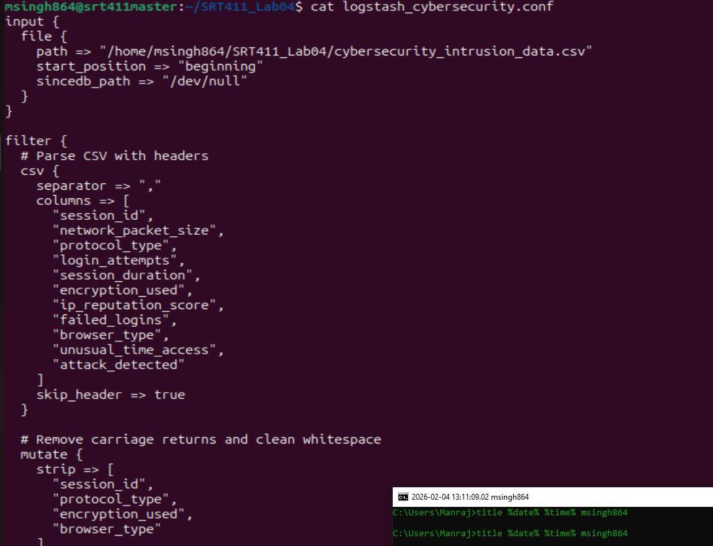

*Figure 1 – Logstash config: file input, CSV parsing, mutate strip/convert filters*

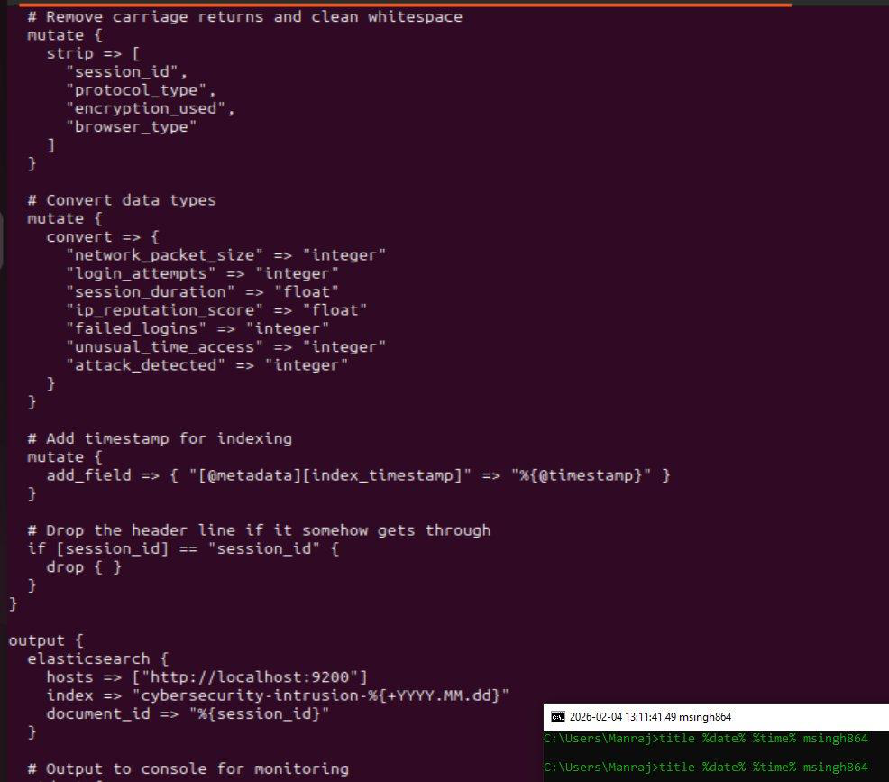

*Figure 2 – Output section: Elasticsearch host, index name, session_id as document ID*

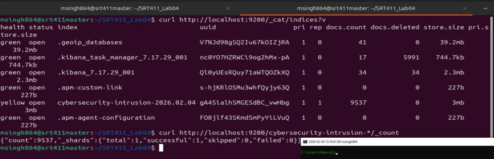

*Figure 3 – Terminal confirming all 9,537 records ingested without errors*

---

## Indexing & Index Pattern

### Elasticsearch Index Verification

```
GET cybersecurity_intrusion/_count
→ { "count": 9537 }
```

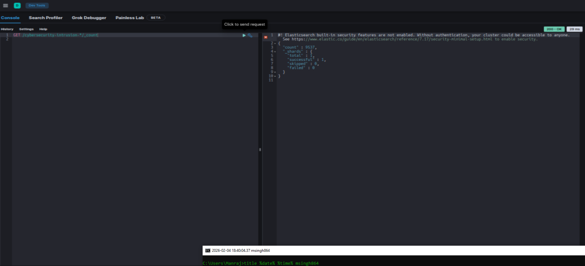

*Figure 4 – Dev Tools confirming 9,537 documents indexed successfully*

### Kibana Index Pattern

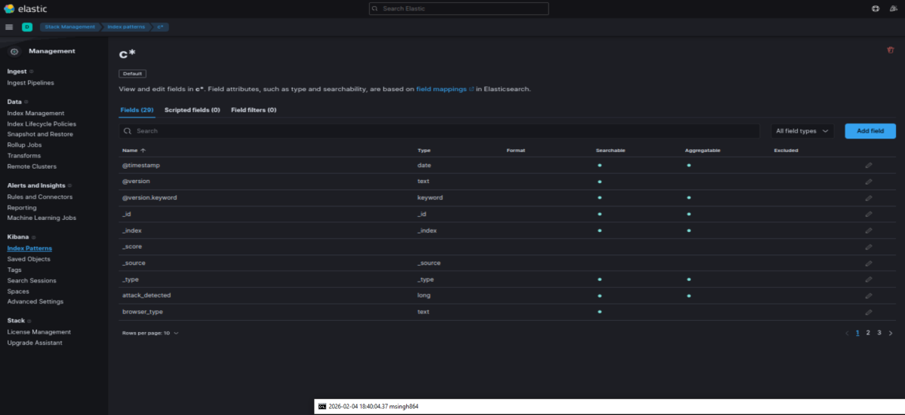

*Figure 5 – All 11 fields visible in Kibana index pattern*

---

## Searching with Query DSL

### Failed Login Analysis (Range Query)

Filtered sessions where `failed_logins >= 2` — returned **4,576 sessions (48%)** indicating widespread authentication failure patterns.

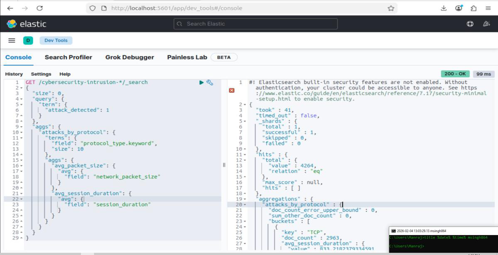

*Figure 6 – Dev Tools range query filtering sessions with 2+ failed login attempts*

### Attack Detection Analysis (Term Query)

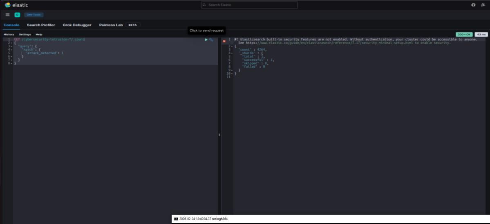

*Figure 7 – Term query identifying 4,264 sessions (44.7%) flagged as attacks*

---

## Visualizations

### Visualization 1: Attack Distribution by Protocol Type

Stacked bar chart showing TCP as the dominant attack vector at **69.5% of all attacks** (2,963/4,264), followed by UDP at 25.6% and ICMP at 4.9%.

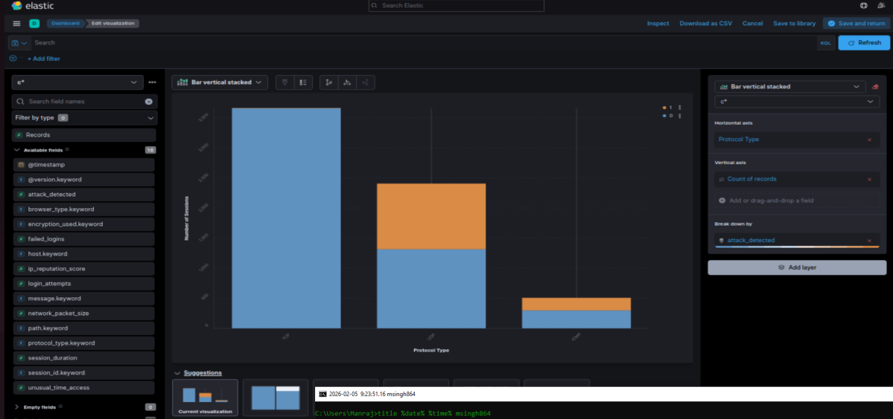

*Figure 8 – Vertical stacked bar: protocol_type vs attack_detected count*

---

### Visualization 2: Attack Distribution by Encryption Method

Donut chart showing attacks represent 44.71% of all sessions. Within attacks: AES 21.55%, DES 13.62%, unencrypted 9.54%.

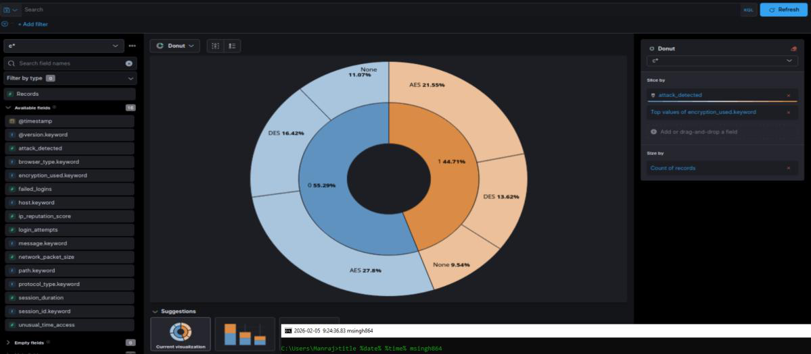

*Figure 9 – Donut chart: inner ring = attack/normal split, outer ring = encryption method*

---

### Visualization 3: Encryption vs Attack Distribution

Horizontal stacked bar comparing attack rates per encryption type. Unencrypted sessions show the highest attack proportion relative to total traffic.

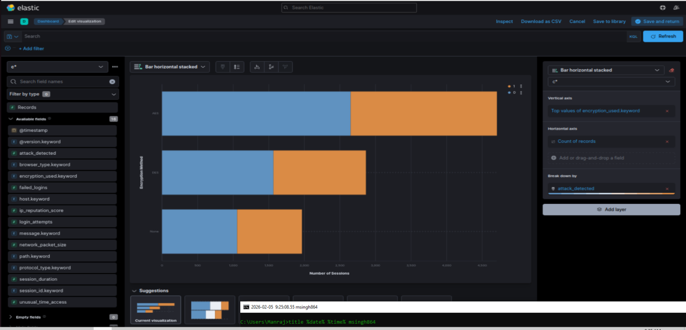

*Figure 10 – Horizontal stacked bar: encryption_used vs session count broken down by attack_detected*

---

### Visualization 4: Browser Attack Analysis

Data table showing attack rates by browser. Unknown browsers had a **73.1% attack rate** vs 42–44% for standard browsers, indicating bot traffic or malicious user agents.

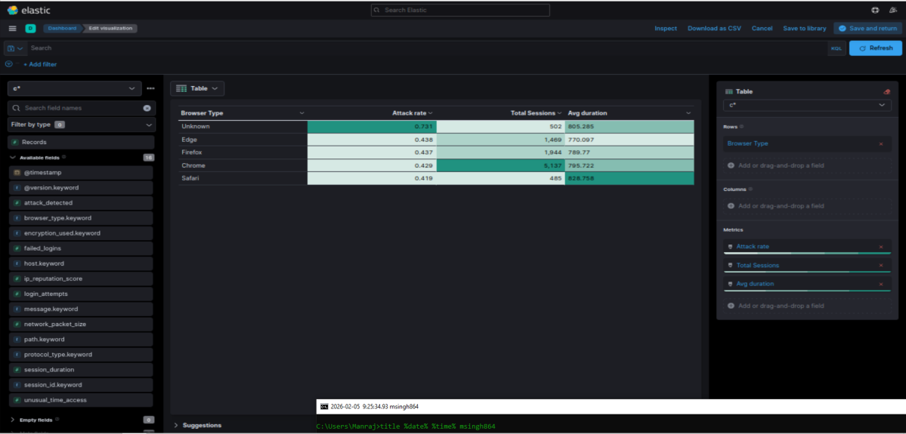

*Figure 11 – Table: browser_type vs avg attack rate, total sessions, avg session duration*

---

## Dashboard

All four visualizations combined into a single interactive Kibana dashboard with cross-panel KQL filtering.

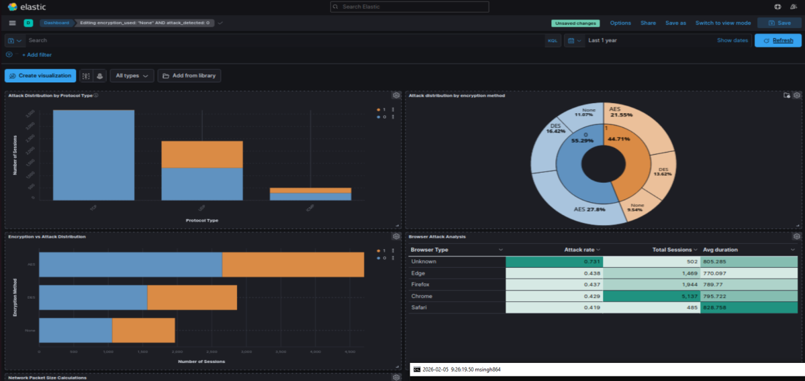

*Figure 12 – Unified dashboard: protocol, encryption, and browser attack panels*

---

## Data Discovery & KQL Filtering

Raw session data explored via Kibana Discover with `attack_detected: 1` filter — confirmed 4,264 matching records.

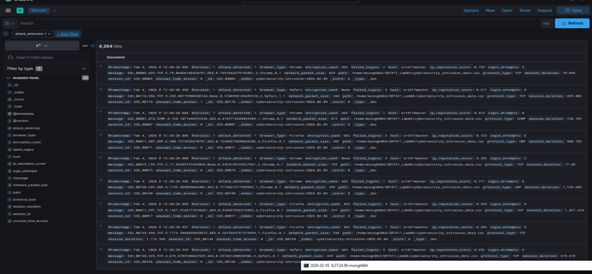

*Figure 13 – Discover interface showing individual session records for attack sessions*

### Filter 1: High Failed Login Sessions
`failed_logins >= 2` → 4,576 sessions

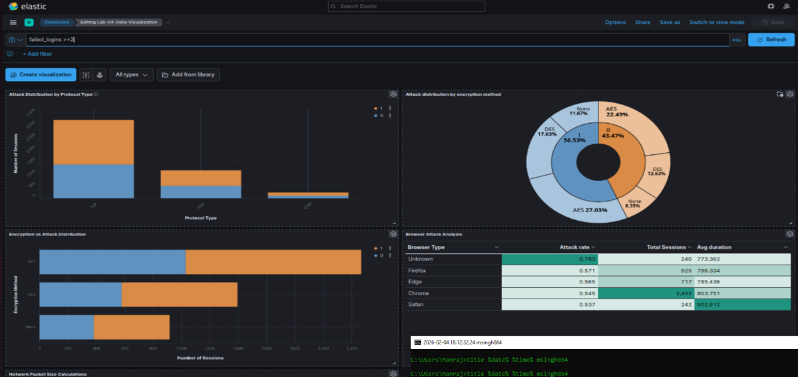

*Figure 14 – Dashboard updating across all panels with failed login filter applied*

### Filter 2: Attack Sessions Only
`attack_detected: 1` → 4,264 sessions (44.7%)

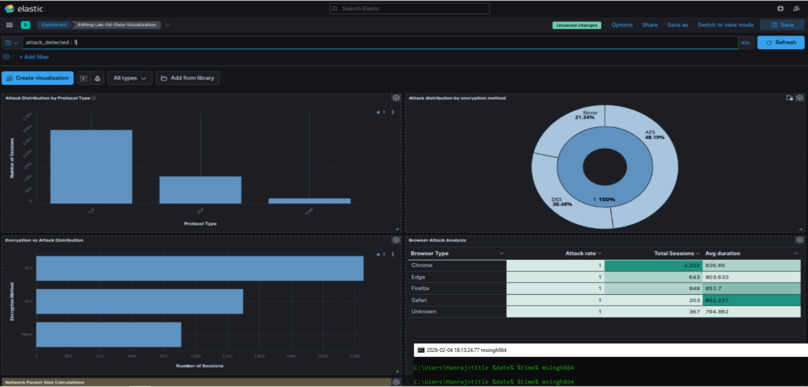

*Figure 15 – All panels filtered to attack sessions only*

### Filter 3: Unencrypted Attack Traffic
`encryption_used: "None" AND attack_detected: 1` → 910 sessions

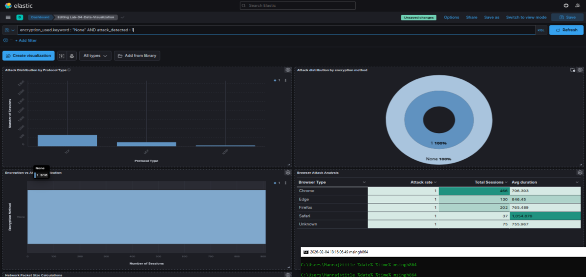

*Figure 16 – Combined KQL filter isolating unencrypted attack traffic*

### Filter 4: Normal Unencrypted Traffic
`encryption_used: "None" AND attack_detected: 0` → 1,148 sessions

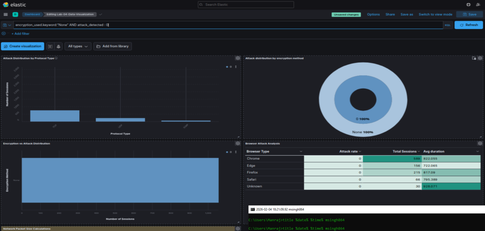

*Figure 17 – Legitimate unencrypted sessions for comparison against Filter 3*

---

## Statistical Analysis

Descriptive stats computed for `network_packet_size` across all 9,537 sessions.

| Metric | Value |
|---|---|
| Mean | 500.43 bytes |
| Median | 498.81 bytes |
| Mode | 64 bytes |
| Standard Deviation | 192.37 bytes |

Median close to mean confirms symmetric distribution. Mode of 64 bytes reflects frequent small TCP control packets.

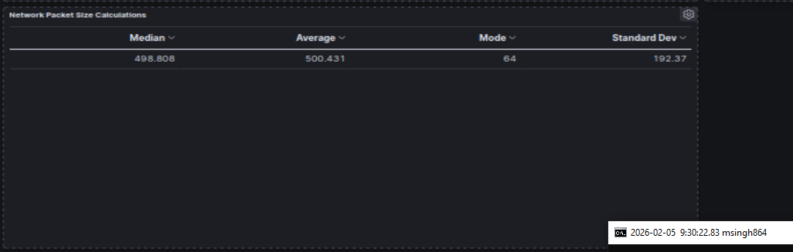

*Figure 18 – Kibana table showing median, average, mode, and standard deviation*

---

## Key Findings

- **44.7%** of all network sessions were flagged as attacks
- **TCP** accounted for 69.5% of detected attacks — primary attack vector
- **Unencrypted sessions** showed disproportionately higher attack rates
- **Unknown browser agents** had a 73.1% attack rate vs 42–44% for standard browsers
- Attack distribution was relatively uniform across encryption types, supporting a **defense-in-depth / zero-trust** approach over targeted hardening

---

## Skills

`Elasticsearch` `Logstash` `Kibana` `ELK Stack` `KQL` `Query DSL` `SIEM` `Data Visualization` `Log Ingestion` `CSV Pipeline` `Security Analytics` `Intrusion Detection` `Statistical Analysis` `Dashboard Design`
